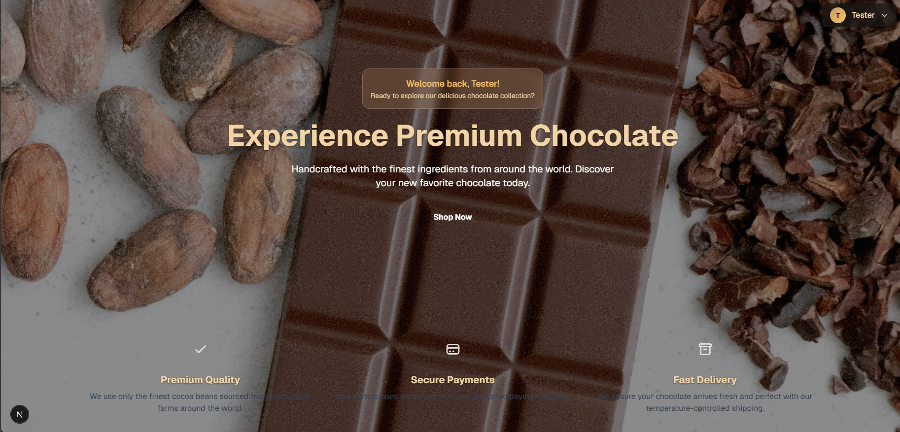
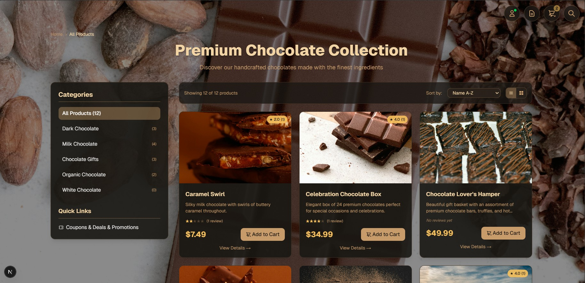
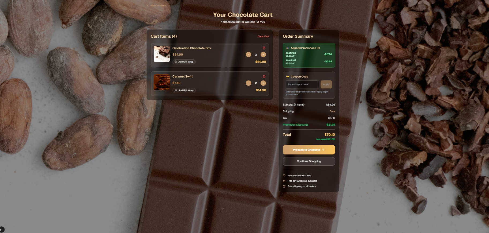
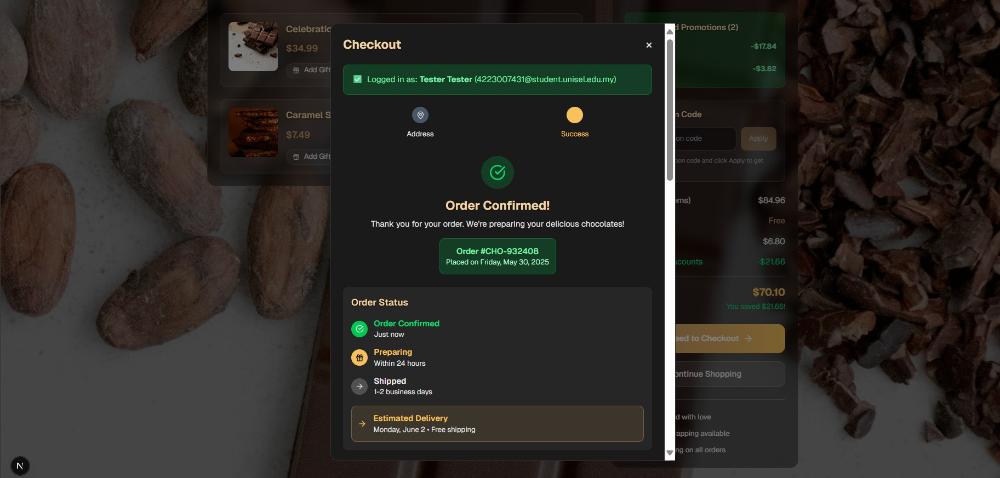

# Chocolate Ecommerce Platform

A modern, full-stack e-commerce solution specializing in premium chocolate products with comprehensive product management, shopping cart functionality, and secure payment integration.


## ✨ Features

### 🔐 User Management
- **User Authentication & Authorization**
  - JWT-based authentication
  - Role-based access control (Admin, Customer)
  - Password reset functionality
  - Email verification
  - Social login integration (Google, Facebook)

### 🛍️ Product Management
- **Advanced Product Catalog**
  - Category-based organization (Truffles, Bars, Gift Sets, etc.)
  - Product variants (size, flavor, packaging)
  - High-quality image galleries
  - Stock management with real-time updates
  - Product reviews and ratings
  - Search and filtering capabilities
  - Recommendations engine

### 🛒 Shopping Experience
- **Smart Shopping Cart**
  - Persistent cart across sessions
  - Real-time price calculations
  - Quantity adjustments
  - Save for later functionality
  - Cart abandonment recovery
  - Wishlist management

### 💳 Payment & Checkout
- **Secure Payment Processing**
  - Stripe integration for secure payments
  - Multiple payment methods support
  - Order confirmation and receipts
  - Tax calculation
  - Shipping cost calculation
  - Promo code support

### 📦 Order Management
- **Complete Order Lifecycle**
  - Order tracking system
  - Email notifications
  - Delivery status updates
  - Order history
  - Return and refund processing
  - Invoice generation

### 📊 Admin Dashboard
- **Comprehensive Management Panel**
  - Sales analytics and reporting
  - Inventory management
  - Customer management
  - Order processing
  - Product content management
  - Marketing tools

## 🏗️ Tech Stack

### Frontend
```
Next.js 14        - React framework with SSR/SSG
TypeScript        - Type-safe development
Tailwind CSS      - Utility-first styling
Redux Toolkit     - State management
React Hook Form   - Form handling
Framer Motion     - Animations
```

### Backend
```
ASP.NET Core 8    - Web API framework
Entity Framework  - ORM for database operations
AutoMapper        - Object mapping
FluentValidation  - Input validation
Serilog          - Structured logging
```

### Database & Storage
```
SQL Server        - Primary database
Redis            - Caching layer
Azure Blob       - Image storage
```

### External Services
```
Stripe API       - Payment processing
SendGrid         - Email service
Cloudinary       - Image optimization
```

## 🚀 Quick Start

### Prerequisites
- .NET 8 SDK
- Node.js 18+
- SQL Server
- Redis (optional, for caching)

### Installation & Setup

1. **Clone the repository**
   ```bash
   git clone https://github.com/yourusername/chocolate-ecommerce.git
   cd chocolate-ecommerce
   ```

2. **Backend Setup**
   ```bash
   cd backend
   dotnet restore
   dotnet ef database update
   dotnet run
   ```

3. **Frontend Setup**
   ```bash
   cd frontend
   npm install
   npm run dev
   ```

4. **Access the application**
   - Frontend: http://localhost:3000
   - Backend API: https://localhost:5001

## 📱 Screenshots & Demo

### 🏠 Homepage

*Modern, responsive homepage featuring premium chocolate collections with elegant hero sections, featured products carousel, and intuitive navigation*

### 🍫 Product Catalog

*Advanced product browsing with category filters, search functionality, grid/list views, and detailed product cards showing ratings and pricing*

### 🛒 Shopping Cart

*Streamlined cart experience with quantity controls, real-time price updates, saved items, and smooth checkout flow*

### 💳 Checkout Process

*Secure multi-step checkout with shipping information, payment options, order review, and Stripe payment integration*

### 📊 Admin Dashboard

*Comprehensive admin control panel with sales analytics, inventory management, order processing, and customer insights*

### 📦 Orders & Reviews

*Complete order management system with tracking, status updates, and customer review functionality*

## 🎬 Live Demo

### Local Development Demo
To showcase your local development version:

1. **Prepare Demo Environment**
   ```bash
   # Ensure both services are running
   cd backend && dotnet run &
   cd frontend && npm run dev &
   ```

2. **Demo Script**
   - **Homepage Tour** (localhost:3000)
     - Showcase hero section and navigation
     - Highlight featured products
     - Demonstrate responsive design
   
   - **Product Browsing**
     - Browse different chocolate categories
     - Use search and filter functionality
     - View product details and reviews
   
   - **Shopping Experience**
     - Add products to cart
     - Modify quantities
     - Apply discount codes
   
   - **Checkout Process**
     - Complete guest or registered checkout
     - Test payment integration (use Stripe test cards)
   
   - **Admin Features**
     - Login to admin dashboard
     - Show inventory management
     - Display sales analytics

3. **Screen Recording Setup**
   ```bash
   # For high-quality demo recording
   # Use OBS Studio or similar for screen capture
   # Record at 1080p for professional presentation
   ```

## 🏛️ Architecture

```
┌─────────────────┐    ┌─────────────────┐    ┌─────────────────┐
│                 │    │                 │    │                 │
│   Next.js App   │◄──►│  ASP.NET Core   │◄──►│   SQL Server    │
│   (Frontend)    │    │     (API)       │    │   (Database)    │
│                 │    │                 │    │                 │
└─────────────────┘    └─────────────────┘    └─────────────────┘
         │                       │                       │
         │                       │                       │
         ▼                       ▼                       ▼
┌─────────────────┐    ┌─────────────────┐    ┌─────────────────┐
│                 │    │                 │    │                 │
│   Stripe API    │    │   SendGrid      │    │     Redis       │
│   (Payments)    │    │   (Email)       │    │   (Caching)     │
│                 │    │                 │    │                 │
└─────────────────┘    └─────────────────┘    └─────────────────┘
```

## 🔧 Configuration

### Environment Variables

#### Backend (.NET)
```
ConnectionStrings__DefaultConnection=Server=...;Database=ChocolateStore;...
Stripe__SecretKey=sk_test_...
Stripe__PublishableKey=pk_test_...
SendGrid__ApiKey=SG...
JWT__SecretKey=your-secret-key
JWT__Issuer=ChocolateEcommerce
JWT__Audience=ChocolateEcommerce
```

#### Frontend (Next.js)
```
NEXT_PUBLIC_API_URL=https://localhost:5001/api
NEXT_PUBLIC_STRIPE_PUBLISHABLE_KEY=pk_test_...
NEXTAUTH_SECRET=your-nextauth-secret
NEXTAUTH_URL=http://localhost:3000
```

## 📈 Performance Features

- **Server-Side Rendering** with Next.js for optimal SEO
- **Image Optimization** with automatic WebP conversion
- **Caching Strategy** using Redis for frequently accessed data
- **Database Optimization** with proper indexing and query optimization
- **CDN Integration** for static asset delivery
- **Code Splitting** for reduced bundle sizes

## 🔒 Security Features

- **Authentication** via JWT tokens
- **Authorization** with role-based access control
- **Input Validation** on both client and server
- **SQL Injection Protection** via Entity Framework
- **XSS Protection** with proper sanitization
- **CSRF Protection** implemented
- **HTTPS Enforcement** in production
- **PCI DSS Compliance** through Stripe

## 🧪 Testing

```bash
# Backend tests
cd backend
dotnet test

# Frontend tests
cd frontend
npm run test

# E2E tests
npm run test:e2e
```

## 🚀 Deployment

### Using Docker
```bash
# Build and run with Docker Compose
docker-compose up --build
```

### Production Deployment
```bash
# Frontend build
cd frontend
npm run build

# Backend publish
cd backend
dotnet publish -c Release -o publish

# Deploy to hosting provider (Azure, AWS, etc.)
```

## 📊 Project Status

- ✅ **Complete & Production Ready**
- ✅ User Authentication System
- ✅ Product Catalog Management  
- ✅ Shopping Cart Functionality
- ✅ Secure Payment Processing
- ✅ Admin Dashboard
- ✅ Order Management System
- ✅ Mobile Responsive Design
- 🔄 Continuous Improvements

## 🎯 Key Achievements

- **Full-Stack Implementation** - Complete e-commerce solution from frontend to database
- **Payment Integration** - Secure Stripe payment processing
- **Admin Management** - Comprehensive dashboard for business operations
- **Modern Tech Stack** - Latest versions of Next.js and .NET Core
- **Production Ready** - Fully functional and deployment-ready

## 🤝 Contributing

1. Fork the repository
2. Create a feature branch (`git checkout -b feature/AmazingFeature`)
3. Commit your changes (`git commit -m 'Add some AmazingFeature'`)
4. Push to the branch (`git push origin feature/AmazingFeature`)
5. Open a Pull Request

## 📄 License

This project is licensed under the MIT License - see the [LICENSE](LICENSE) file for details.

## 📞 Contact

**Project Developer:** Eliezer Kibet
- 📧 Email: elieserkibet@gmail.com
- 💼 LinkedIn: [Eliezer Kibet](https://linkedin.com/in/eliezer-kibet-80217a301/)

## 🙏 Acknowledgments

- [Next.js](https://nextjs.org/) for the amazing React framework
- [ASP.NET Core](https://docs.microsoft.com/en-us/aspnet/core/) for the robust backend
- [Stripe](https://stripe.com/) for secure payment processing
- [Tailwind CSS](https://tailwindcss.com/) for beautiful styling

---

⭐ **Star this repository if you found it helpful!**

**🎉 This project is complete and ready for production deployment!**
